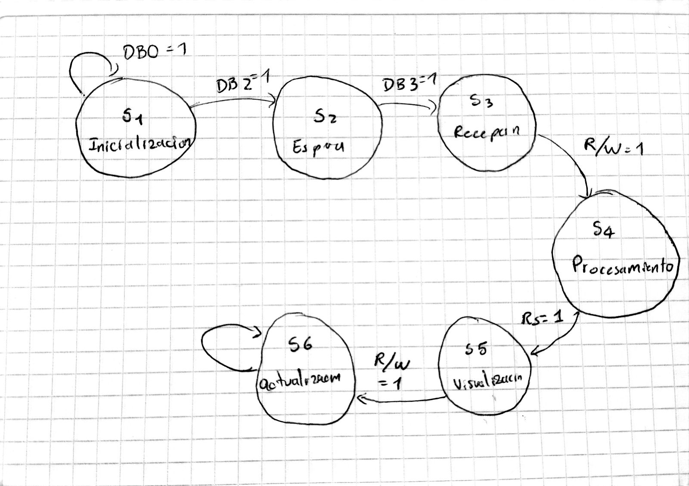
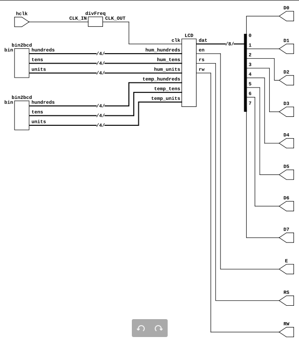
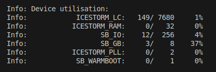

# Lab-4-Digital_1

Para esta practica decidimos mostrar todo el proceso de la implementacion de la pantalla LCD 16x2, desde el proceso de la maquina de estados que se puede ver en la siguiente imagen:

La máquina de estados de la pantalla LCD 16x2 se compone de 6 estados principales: Inicialización (INIT), Espera (WAIT), Recepción de Datos (RECEIVE), Procesamiento de Datos (PROCESS), Visualización (DISPLAY) y Actualización (UPDATE).

En el estado de Inicialización (INIT), la pantalla LCD se configura y se prepara para recibir datos. Una vez inicializada, la pantalla pasa al estado de Espera (WAIT), donde espera recibir datos para mostrar.

Cuando se reciben datos, la pantalla pasa al estado de Recepción de Datos (RECEIVE), donde se almacenan los datos recibidos. Luego, la pantalla pasa al estado de Procesamiento de Datos (PROCESS), donde se procesan los datos recibidos y se convierten en texto para mostrar.

Una vez procesados los datos, la pantalla pasa al estado de Visualización (DISPLAY), donde se muestra el texto procesado. Finalmente, la pantalla pasa al estado de Actualización (UPDATE), donde se actualiza el texto mostrado con nuevos datos.

La transición entre estados se controla mediante señales de control, como RS (Registro de Selección) y E (Enable), que indican cuando la pantalla debe cambiar de estado.

Por otro luego de crear el codigo en verilog necesario para la LCD, pudimos obetner el siguiente circuito que lo describe: 

El place and rout arrojó que se usaron 149 compuertas lógicas de diversos tipos. Si se estima que cada compuerta usa alrededor de 

